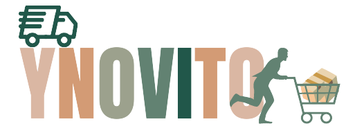

# YNOVITO 🛍️

YNOVITO is an eCommerce website built and designed by NRAN Group.

  

 

# This project is created using:

# Project Description

YNOVito.ma is a C2C shopping platform where users can offer and sell their own items to other users.
YNOVito.ma accepts all kind of items and display them by category. From vehicles, and their spare parts to household appliance, and even real estate.

# Project Details
### 1. Authentification and user registration
- Login
- Register
- Forget Password
- Email Verification
- Remember Me

### 2. Registered and authenticated users can post offers
Authenticated users can post some items in the platform and make them sellable, for 
so, they must click a button “Post new item”, they will be redirected to create post 
page, where they must provide informations for the item they want to sell, such as:

- Item’s title: represents the name that will be displayed for the offer.
- Item’s description: a detailed description that will be displayed once a 
user clicks on the offer’s post to see it details.
- Item’s price: this is the price in MAD to display with the offer.
- Item’s category: represents the category of the item. This field must 
contain a select input type listing all categories of the website as options. 
And the user (poster) must choose one.
- Item’s images: An item must have at least one main image, and max 6 
images.
- Item’s location: this location is where users can physically see the item (in 
case of a possible purchase). By default, if the user doesn’t specify the 
location, it is automatically filled with the location where the user is. (Based 
on address of the poster user).
- Item’s brand: this must contain the brand of the property you want to sell. 
You can let it empty.
- Item’s state: this represents the state of the property you want to sell; it 
accepts one of these values: New, Almost New, Normal, Old/obsolete.

### 3.  Show different products and browse them by category

- IT and electrics: household appliances, IT devices, phones etc..
- Vehicles: bikes, motorcycles, cars and other vehicles…
- Real Estate
- Clothing and well-being
- Hobbies and entertainment

### 4.  Display product detail page, showing all item’s information
- When clicking on a post, we should display a page containing all information of the post. Such as the informations put by the poster (from IV. 2.), added to the posting date, the poster’s name and location.
- The poster’s phone number must be hidden first, the user must unhide it in order to display it. And use it to contact the owner of the item.

### 5.  Administration Panel

### Simple Admin privileges:
- Admin actions on Users: 
  - Check all registered users; no matter their state, confirmed (active) or non-confirmed. 
  - Update user’s information, and archive/activate user’s accounts.
  - List user’s posts and moderate them.
- Admin actions on User’s Posts:
  - Administrators have ability to confirm freshly created user’s posts to publish it.
  - Admins can update and archive existing post’s information but cannot add new post for a specific user.
 - Admins can perform action on categories
  - Create new category / update existing category
 - Admins can manually activate account for a non-confirmed user, and block/archive a user.

### Super-Admin privileges:
- All privileges of a simple admin + grant / revoke admin privileges for users.
- Administrator can perform all this action from an “Administration Dashboard” page 
that displays also some statistics of the website (total user’s number, total sold posts, 
total non-confirmed Posts, total confirmed and not yet sold posts…)

# Team Members
### - [AYOUJIL Nada](https://github.com/nadaayoujil)
### - [MEDAGHRI ALAOUI Rania](https://github.com/alaouirania)
### - [FOUAD Amine](https://github.com/FAGuts)
### - [HONISCH Nassima](https://github.com/LeiNHon)

# How To Start The Project
1/ Create database called 'laravelapp' in phpmyadmin
2/ php artisan migrate
3/ php artisan migrate:fresh --seed
4/ php artisan db:seed --class=PermissionTableSeeder
    php artisan db:seed --class=RoleTableSeeder
    php artisan db:seed --class=UserTableSeeder
    php artisan db:seed --class=CategorySeeder
5/ php artisan serve
